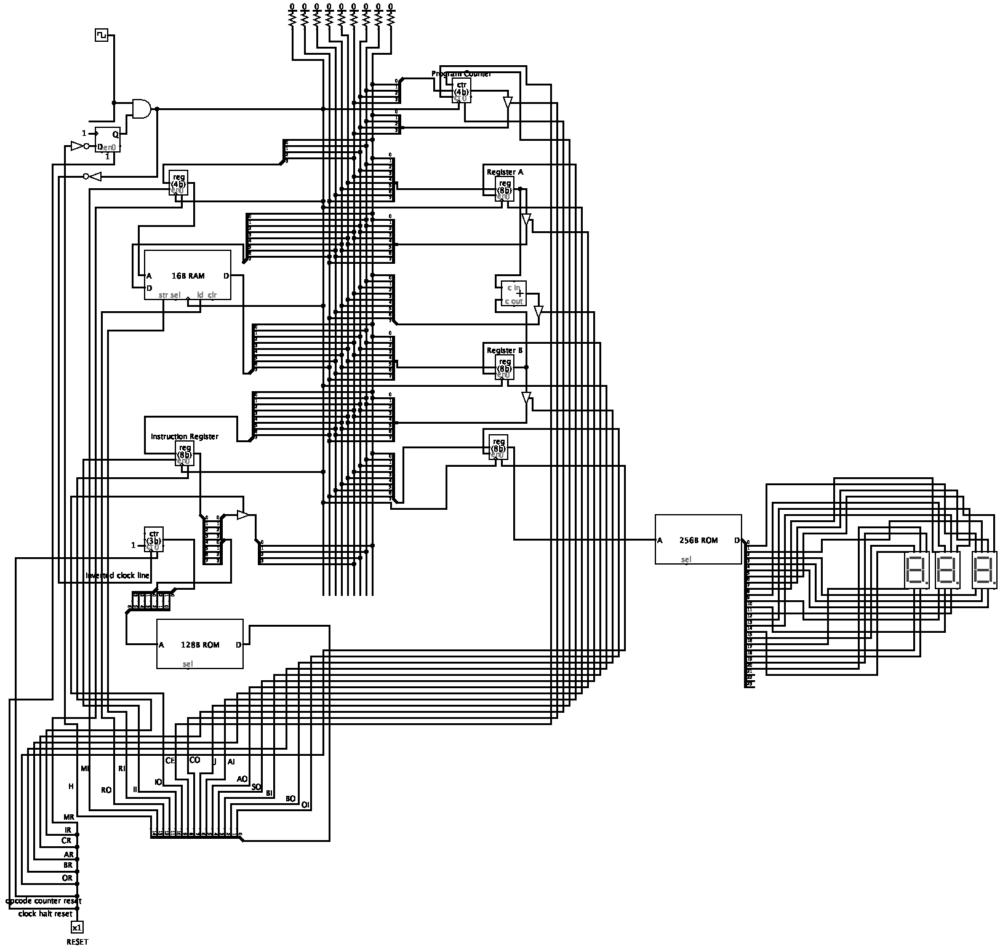

# 8-bit-computer

After watching [Ben Eater's 8-bit computer videos](https://eater.net/8bit) on Youtube,
I try to implement the whole thing with Logism.

You can open the circuit using Logism software, the whole project is in the `8bit-computer.circ` file.

I later built another [16-bit computer](https://github.com/trungdq88/teris-16-bit) following the NAND to Tetris course.

